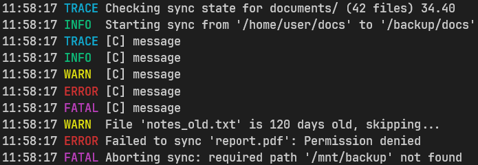

# Echo

Echo is a lightweight and extensible logging library for OCaml with C bindings, allowing both OCaml and C code to emit structured log messages through a unified logging interface.



## Features

- C bindings for easy logging integration with your C lib (see C API section below)
- Supports output to `stdout`, `stderr`, and .log files
- Standard log levels: `TRACE`, `INFO`, `WARN`, `ERROR`, `FATAL`
- Manual flushing of logs

---

## Usage

### In OCaml

```ocaml
let main () =
  (* Optional: Redirect logs to a file *)
  Echo.set_out (File "debug.log");

  (* Log from OCaml *)
  Echo.trace "Starting analysis of '%s'" "report.csv";
  Echo.info "Processed %d items" 42;
  Echo.warn "Unusual delay: %.2f ms" 123.45;
  Echo.error "Failed to read file '%s'" "data.bin";
  Echo.fatal "Unrecoverable crash in module '%s'" "engine";

  Echo.flush ()

let () = main ()
```

### In C

```c
#include "echo.h"

void dummie_c_fn()
{
    echo_trace("%s", "message");
    echo_info("%s", "message");
    echo_warn("%s", "message");
    echo_error("%s", "message");
    echo_fatal("%s", "message");
}
```

---

## API Overview

### OCaml

```ocaml
val set_out : out_type -> unit
val trace : ('a, unit, string, unit) format4 -> 'a
val info : ('a, unit, string, unit) format4 -> 'a
val warn : ('a, unit, string, unit) format4 -> 'a
val error : ('a, unit, string, unit) format4 -> 'a
val fatal : ('a, unit, string, unit) format4 -> 'a
val flush : unit -> unit
```

### C

Don't forget #include <echo.h>

```c
void echo_trace(const char *fmt, ...);
void echo_info(const char *fmt, ...);
void echo_warn(const char *fmt, ...);
void echo_error(const char *fmt, ...);
void echo_fatal(const char *fmt, ...);
```

---

## License

MIT License — free to use, modify, and distribute.

---

## Contributions

Contributions are welcome! Feel free to open issues or submit PRs if you find bugs or have ideas for improvement.
